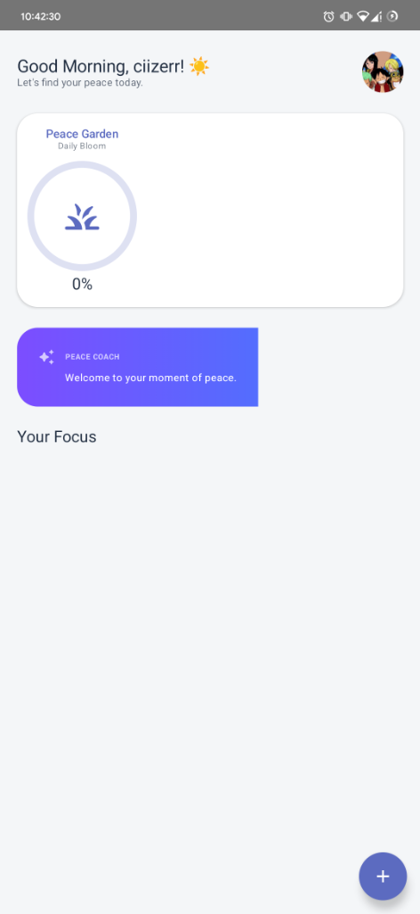
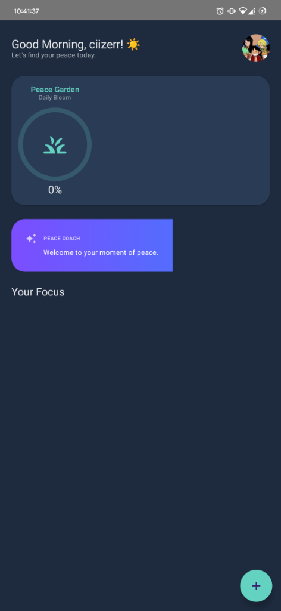

# Peace 🌿 - Pre-Release v0.1.0-alpha
> *A Minimalist, AI-Powered Daily Assistant with Complete Settings & Glassmorphic Design*

<div align="center">
  
  <br/>
  <br/>
  <p>
    <strong>🎉 PRE-RELEASE READY</strong><br/>
    Calm engagement, intelligent reminders, and gentle progress tracking built with Jetpack Compose and Google Gemini.
  </p>
  <br/>
  <a href="https://kotlinlang.org/"></a>
  <a href="https://developer.android.com/jetpack/compose"></a>
  <a href="https://ai.google.dev/"></a>
  
</div>

---

## 🚀 What's New in Pre-Release v0.1.0-alpha

### ✨ **Complete Settings Implementation**
- **🎵 Rhythms Settings**: Full notification control, sound management, vibration settings, quiet hours, and intelligent nag mode
- **🏛️ Sanctuary Settings**: Comprehensive data management, backup & sync, privacy controls, and secure data operations
- **ℹ️ About Screen**: Detailed app information, feature highlights, support options, and legal documentation

### 🎨 **Enhanced Glassmorphic Design**
- **🌊 Haze Integration**: Beautiful blur effects throughout the interface
- **🎭 Dynamic Theming**: Seamless light/dark mode transitions
- **📱 Consistent UI**: Unified design language across all screens

### 🔧 **Robust Data Management**
- **💾 DataStore Integration**: Persistent settings with real-time updates
- **🔄 StateFlow Architecture**: Reactive UI updates and state management
- **🛡️ Privacy First**: All data stored locally on device

---

## 📱 Screenshots

|  |  |
|:---:|:---:|
| **Morning Light Theme** | **Night Sky Theme** |

*More screenshots coming with the full release*

---

## 🛠️ Technical Architecture

### **Core Technologies**
- **🤖 Kotlin**: 100% Kotlin codebase
- **🎨 Jetpack Compose**: Modern declarative UI with Material 3
- **🧠 Google Gemini API**: AI-powered natural language processing
- **🏛️ Architecture**: MVVM with Clean Architecture principles
- **🗄️ Data Layer**: Room Database + DataStore Preferences
- **🌊 Reactive**: Kotlin Coroutines & StateFlow

### **Key Dependencies**
```kotlin
// UI & Design
implementation("androidx.compose.ui:ui")
implementation("androidx.compose.material3:material3")
implementation("dev.chrisbanes.haze:haze")

// Architecture
implementation("androidx.hilt:hilt-navigation-compose")
implementation("androidx.lifecycle:lifecycle-viewmodel-compose")

// Data
implementation("androidx.room:room-runtime")
implementation("androidx.datastore:datastore-preferences")
```

---

## ✨ Feature Highlights

### 🎵 **Rhythms (Notification Settings)**
- **🔔 Smart Notifications**: Toggle system with customizable behavior
- **🎶 Soundscape Control**: Volume adjustment and peaceful sound selection
- **📳 Vibration Management**: Haptic feedback customization
- **🌙 Quiet Hours**: Automatic do-not-disturb scheduling
- **⏰ Nag Mode**: Intelligent reminder persistence with configurable intervals

### 🏛️ **Sanctuary (Data & Privacy)**
- **📊 History Management**: View and export your activity logs
- **☁️ Backup & Sync**: Automatic data backup with timestamp tracking
- **🔒 Privacy Controls**: Analytics and crash reporting toggles
- **⚠️ Danger Zone**: Secure data clearing with confirmation dialogs

### ℹ️ **About & Information**
- **📱 App Details**: Version info, build details, and update checking
- **⭐ Feature Showcase**: Highlight key capabilities and benefits
- **🤝 Support Options**: Rate app, share, and bug reporting
- **📄 Legal Compliance**: Privacy policy, terms, and open source licenses

---

## 🚀 Installation & Setup

### **Prerequisites**
- Android Studio Ladybug (2024.2.1) or newer
- Android SDK 26+ (Android 8.0+)
- Google Gemini API Key (optional for AI features)

### **Quick Start**
1. **Clone the repository**:
   ```bash
   git clone https://github.com/ciizerr/Peace.git
   cd Peace
   ```

2. **Switch to pre-release branch**:
   ```bash
   git checkout feature/complete-settings
   ```

3. **Configure API Key** (Optional):
   ```properties
   # local.properties
   GEMINI_API_KEY="your_gemini_api_key_here"
   ```

4. **Build and Run**:
   ```bash
   ./gradlew assembleDebug
   # Or use Android Studio's Run button
   ```

---

## 🧪 Testing the Pre-Release

### **What to Test**
- ✅ **Settings Persistence**: Change settings and verify they persist after app restart
- ✅ **Theme Switching**: Toggle between light/dark modes
- ✅ **Glassmorphic Effects**: Verify blur effects work on your device
- ✅ **Navigation Flow**: Test all screen transitions and back navigation
- ✅ **Data Management**: Try export/import and backup features

### **Known Limitations**
- 🚧 Some placeholder actions in About screen (rate app, share, etc.)
- 🚧 Update functionality requires backend integration
- 🚧 Export/Import features show dialogs but don't perform actual file operations

---

## 📋 Roadmap to Full Release

### **Phase 1: Core Completion** ✅
- [x] Complete settings screens implementation
- [x] Glassmorphic design system
- [x] Data persistence layer
- [x] Navigation architecture

### **Phase 2: Feature Polish** 🚧
- [ ] Implement actual export/import functionality
- [ ] Add update checking mechanism
- [ ] Complete placeholder actions in About screen
- [ ] Add comprehensive testing suite

### **Phase 3: Production Ready** 📋
- [ ] Performance optimization
- [ ] Accessibility improvements
- [ ] Play Store preparation
- [ ] Documentation completion

---

## 🤝 Contributing to Pre-Release

We welcome feedback and contributions! Here's how you can help:

### **Reporting Issues**
- 🐛 **Bug Reports**: Use GitHub Issues with detailed reproduction steps
- 💡 **Feature Requests**: Suggest improvements or new features
- 🎨 **UI/UX Feedback**: Share thoughts on design and user experience

### **Development**
```bash
# Fork the repository
git fork https://github.com/ciizerr/Peace.git

# Create a feature branch
git checkout -b feature/your-improvement

# Make your changes and test thoroughly
./gradlew test
./gradlew assembleDebug

# Submit a pull request
```

---

## 📊 Pre-Release Metrics

- **📱 Minimum SDK**: Android 8.0 (API 26)
- **🎯 Target SDK**: Android 14 (API 34)
- **📦 APK Size**: ~8MB (estimated)
- **🏗️ Build Time**: ~30 seconds (clean build)
- **🧪 Test Coverage**: Core functionality tested

---

## 🙏 Acknowledgments

### **Open Source Libraries**
- **[Haze](https://github.com/chrisbanes/haze)** by Chris Banes - Glassmorphism blur effects
- **[Jetpack Compose](https://developer.android.com/jetpack/compose)** - Modern Android UI toolkit
- **[Hilt](https://dagger.dev/hilt/)** - Dependency injection framework
- **[Room](https://developer.android.com/training/data-storage/room)** - Local database solution

### **Design Inspiration**
- Material 3 Design Guidelines
- Glassmorphism design trends
- Mindfulness and wellness app patterns

---

## 📄 License

This project is licensed under the MIT License - see the [LICENSE](LICENSE) file for details.

---

## 📞 Pre-Release Support

For pre-release specific issues:
- 📧 **Email**: [Create an issue on GitHub](https://github.com/ciizerr/Peace/issues)
- 💬 **Discussions**: Use GitHub Discussions for questions
- 🐛 **Bug Reports**: GitHub Issues with "pre-release" label

---

<div align="center">
  <sub>🌿 Built with peace and mindfulness by <a href="https://github.com/ciizerr">ciizerr</a> 🌿</sub>
  <br/>
  <sub><strong>Pre-Release v0.1.0-alpha</strong> • Ready for testing and feedback</sub>
</div>