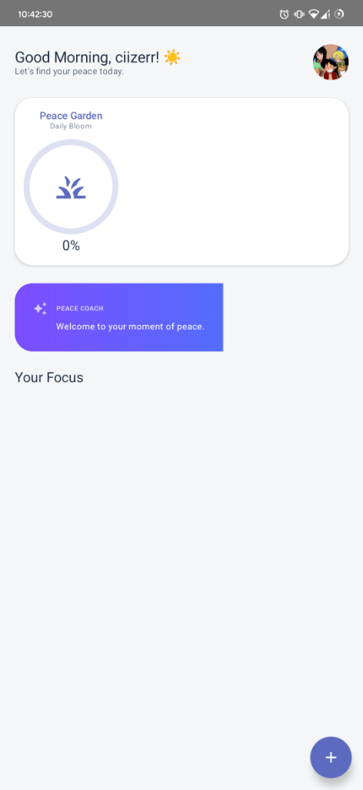
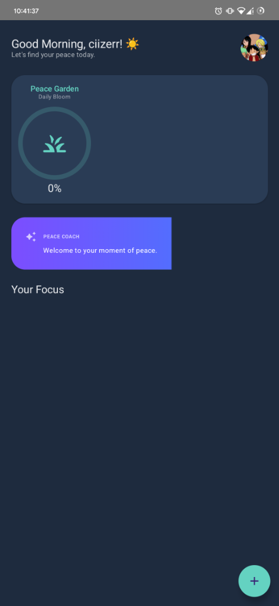

# Peace 🌿
> *A Minimalist, AI-Powered Daily Assistant*

<div align="center">
  
  <br/>
  <br/>
  <p>
    Calm engagement, intelligent reminders, and gentle progress tracking built with Jetpack Compose and Google Gemini.
  </p>
  <br/>
  <a href="https://kotlinlang.org/"></a>
  <a href="https://developer.android.com/jetpack/compose"></a>
  <a href="https://ai.google.dev/"></a>
</div>

---

## 📱 The Visual Hook

|  |  |
|:---:|:---:|
| **Morning Light** | **Night Sky** |

> *Note: Screenshots coming soon!*

## 📖 About the Project

Most reminder apps are stressful lists. **Peace** is designed around the philosophy of *"Calm Engagement."* It uses on-device AI to understand natural language requests and provides a **"Peace Garden"** that visually grows as you complete daily tasks, replacing stressful notifications with gentle encouragement.

## 🛠️ Tech Stack

- **🤖 Kotlin**: 100%
- **🎨 Jetpack Compose**: Material 3 Design
- **🧠 Google Gemini API**: AI Intelligence
- **🏛️ Architecture**: MVVM with Clean Architecture principles
- **🗄️ Local Data**: Room Database & DataStore Preferences
- **🌊 Asynchronous**: Kotlin Coroutines & Flow

## ✨ Key Features

- **✨ Natural Language Processing**: Type tasks like you speak (e.g., *"Yoga at 7am"*), parsed instantly by Gemini.
- **🌗 Dynamic Theming**: A cohesive "Night Sky" dark mode and "Morning Light" light mode.
- **🪴 Visual Progress Tracker**: A minimalist "Peace Garden" that grows with daily consistency.
- **🔑 Bring Your Own Key (BYOK)**: Secure architecture allowing users to input their own Gemini API key via DataStore.

## 🚀 Getting Started

### Prerequisites
- Android Studio (Ladybug/2025 version recommended)
- A Google Gemini API Key

### Setup Instructions

1.  **Clone the repository**:
    ```bash
    git clone https://github.com/ciizerr/Peace.git
    ```

2.  **Open in Android Studio**:
    Open the project folder in Android Studio.

3.  **Configure API Key (Important)**:
    To enable AI features, create a `local.properties` file in the project root if it doesn't exist, and add your key:
    ```properties
    GEMINI_API_KEY="your_actual_api_key_here"
    ```
    *Alternatively, you can input the key directly in the app settings via the "BYOK" feature.*

4.  **Run**:
    Sync Gradle and run the app on an emulator or device.

## 🤝 Contributing

We believe in calm collaboration. If you have ideas to make Peace even more serene, feel free to open an issue or submit a pull request.

## 📄 License

This project is licensed under the MIT License - see the [LICENSE](LICENSE) file for details.

---
<div align="center">
  <sub>Built with 💜 by <a href="https://github.com/ciizerr">ciizerr</a></sub>
</div>
