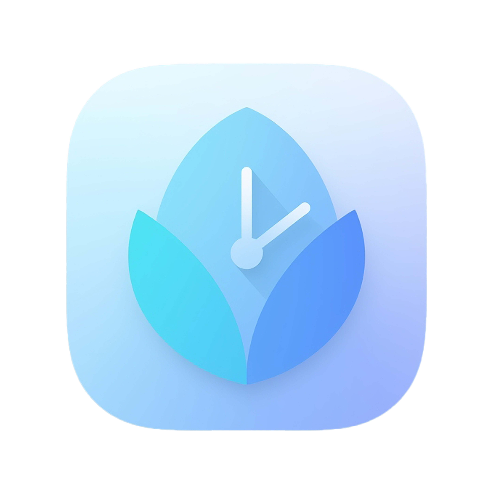
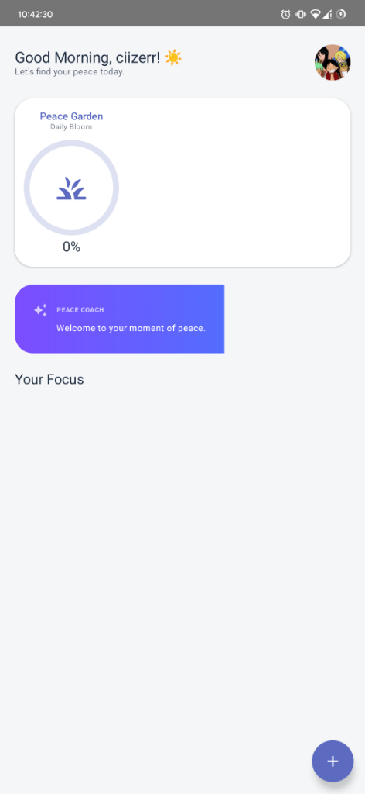
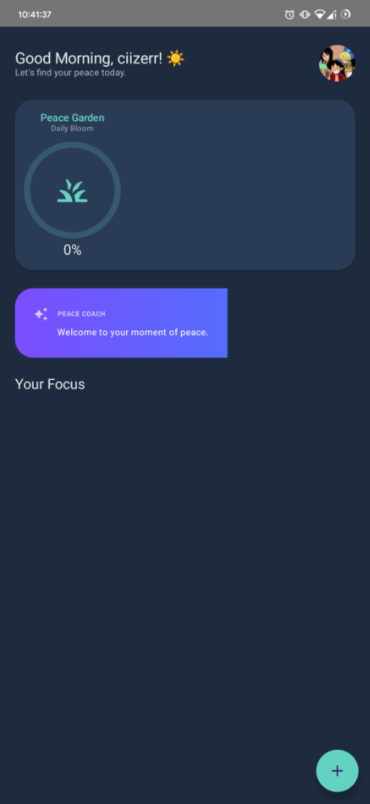

# Peace 🌿
> *A Comprehensive, AI-Powered Productivity Suite*

<div align="center">
  
  <br/>
  <br/>
  <p>
    Calm engagement, intelligent reminders, rich content support, and gentle progress tracking built with Jetpack Compose and Google Gemini.
  </p>
  <br/>
  <a href="https://kotlinlang.org/"></a>
  <a href="https://developer.android.com/jetpack/compose"></a>
  <a href="https://ai.google.dev/"></a>
  <a href="https://github.com/ionic-team/ionicons"></a>
</div>

---

## 📱 The Visual Hook

|  |  |
|:---:|:---:|
| **Morning Light** | **Night Sky** |

## 📖 About the Project

Most reminder apps are stressful lists. **Peace** is designed around the philosophy of *"Calm Engagement."* It uses AI to understand natural language requests and provides a **"Peace Garden"** that visually grows as you complete daily tasks, replacing stressful notifications with gentle encouragement.

**Peace** has evolved into a comprehensive productivity suite with advanced customization, rich content support, intelligent ML suggestions, and seamless integration with your digital life—all while maintaining its core philosophy of calm, focused productivity.

## 🛠️ Tech Stack

- **🤖 Kotlin**: 100%
- **🎨 Jetpack Compose**: Material 3 Design with custom theming
- **🧠 Google Gemini API**: Natural language processing
- **🤖 On-Device ML**: Pattern analysis and intelligent suggestions
- **🏛️ Architecture**: MVVM with Clean Architecture principles
- **🗄️ Local Data**: Room Database & DataStore Preferences
- **🌊 Asynchronous**: Kotlin Coroutines & Flow
- **📅 Calendar Integration**: Google Calendar API
- **🎨 Custom Icons**: Ionicons vector drawable pack
- **🏠 Widgets**: Glance for home screen widgets
- **🧪 Testing**: Kotest property-based testing, JUnit, Espresso

## ✨ Core Features

### 🎯 Smart Task Management
- **✨ Natural Language Processing**: Type tasks like you speak (e.g., *"Yoga at 7am"*), parsed instantly by Gemini
- **📋 Subtasks & Checklists**: Break down complex tasks with unlimited subtasks and visual progress tracking
- **🔁 Nag Mode**: Multi-repetition reminders with flexible or strict scheduling
- **⚡ Panic Loop**: Persistent 2-minute reminders when you snooze (up to 30 minutes)
- **🎯 Priority Levels**: High, Medium, Low priority with visual indicators
- **📂 Categories**: Organize tasks by Work, Study, Health, Home, or General

### 🎨 Advanced Customization
- **🌍 Multi-Language Support**: 7+ languages with in-app language selection (no device restart required)
- **✍️ Custom Fonts**: 20+ bundled fonts with adjustable padding (0-20dp)
- **🎨 Ionicons Integration**: 1,300+ custom vector icons throughout the app
- **🖼️ Background Images**: Set attachment images as backgrounds with adjustable blur (0-100)
- **🎞️ Slideshow Mode**: Auto-cycle through multiple background images every 5 seconds
- **🌗 Dynamic Theming**: Seamless light/dark mode with custom color palettes

### 📝 Rich Content Support
- **📝 Notes**: Add unlimited timestamped notes to any reminder
- **📷 Image Attachments**: Attach multiple images with thumbnail previews
- **🔊 Custom Alarm Sounds**: Choose unique alarm sounds for each reminder
- **🎵 Sound Preview**: Test alarm sounds before saving

### 🌱 Enhanced Peace Garden
- **🎨 4 Garden Themes**: Zen, Forest, Desert, and Ocean with unique visuals
- **📈 10 Growth Stages**: Visual progression as you complete tasks
- **🔥 Streak Tracking**: Track consecutive days of task completion
- **🏆 Milestones**: Achievements at 7, 30, 100, and 365-day streaks
- **🎉 Celebrations**: Animated celebrations for growth stages and milestones

### 🤖 ML-Powered Suggestions
- **⏰ Optimal Time Suggestions**: AI recommends best times based on completion patterns
- **🎯 Priority Adjustments**: Smart priority recommendations based on behavior
- **🔁 Recurring Pattern Detection**: Suggests converting manual tasks to recurring reminders
- **☕ Break Reminders**: Suggests breaks based on focus session duration
- **💪 Habit Formation**: Encourages consistent task completion
- **📋 Template Creation**: Suggests templates for frequently created tasks
- **🎯 Focus Session Optimization**: Recommends optimal focus durations
- **📊 Confidence Scores**: Each suggestion includes a 0-100% confidence rating
- **🧠 Learning System**: Adapts based on your acceptance/dismissal of suggestions

### 🔗 Integration & Sharing
- **📅 Google Calendar Sync**: One-way sync to Google Calendar with manual/automatic sync
- **🔗 Deep Link Sharing**: Share reminders via SMS, WhatsApp, email, or any messaging app
- **📱 App Links**: Recipients with Peace installed can import reminders with one tap
- **🔄 Independent Copies**: Shared reminders create independent copies (no live sync)

### 🏠 Home Screen Widgets
- **📅 Today's Reminders Widget**: View all today's tasks at a glance
- **🌱 Peace Garden Widget**: Display garden progress and streak on home screen
- **⚡ Quick-Add Widget**: Create reminders instantly with AI parsing
- **🎨 Theme-Aware**: Widgets adapt to your app theme
- **🔄 Auto-Update**: Widgets refresh automatically when data changes

### 🔔 Enhanced Notifications
- **🎨 Custom Layout**: Beautiful notifications with Peace branding
- **✅ Complete Button**: Mark tasks complete from notification
- **⏰ Snooze Button**: Enter panic loop or snooze for configured duration
- **❌ Dismiss Button**: Cancel alarm and remove notification
- **📦 Bundled Notifications**: Multiple simultaneous reminders grouped intelligently
- **📊 Progress Display**: Shows nag mode repetition progress (e.g., "2 of 5 complete")
- **🎯 Priority Indicators**: Visual priority badges in notifications
- **📂 Category Icons**: Category-specific icons using Ionicons

### ⚙️ Feature Toggle System
- **🎛️ Granular Control**: Enable/disable advanced features individually
- **🔒 Privacy First**: Disable ML suggestions, calendar sync, or sharing as needed
- **💾 Persistent Settings**: Toggle states persist across app restarts
- **🎨 Clean UI**: Disabled features are completely hidden from the interface

## 🔑 Bring Your Own Key (BYOK)

Peace respects your privacy and gives you control over AI features. You can input your own Gemini API key via DataStore, ensuring your data never leaves your device except for AI parsing requests.

## 🚀 Getting Started

### Prerequisites
- Android Studio (Ladybug/2025 version recommended)
- Android device or emulator running Android 8.0 (API 26) or higher
- A Google Gemini API Key (for AI features)
- Google Calendar API credentials (optional, for calendar sync)

### Setup Instructions

1.  **Clone the repository**:
    ```bash
    git clone https://github.com/ciizerr/Peace.git
    ```

2.  **Open in Android Studio**:
    Open the project folder in Android Studio.

3.  **Configure API Key (Important)**:
    To enable AI features, create a `local.properties` file in the project root if it doesn't exist, and add your key:
    ```properties
    GEMINI_API_KEY="your_actual_api_key_here"
    ```
    *Alternatively, you can input the key directly in the app settings via the "BYOK" feature.*

4.  **Configure Google Calendar (Optional)**:
    For calendar sync features, follow the setup guide in [docs/GOOGLE_CALENDAR_SETUP.md](GOOGLE_CALENDAR_SETUP.md).

5.  **Run**:
    Sync Gradle and run the app on an emulator or device.

## 📚 Documentation

Comprehensive documentation is available in the following guides:

- **[User Guide](docs/USER_GUIDE.md)**: Complete guide to all features and how to use them
- **[ML Suggestions Guide](docs/ML_SUGGESTIONS_GUIDE.md)**: Understanding and using intelligent suggestions
- **[Widget Guide](docs/WIDGET_GUIDE.md)**: Setting up and using home screen widgets
- **[Deep Link Format](docs/DEEP_LINK_FORMAT.md)**: Technical specification for reminder sharing
- **[Google Calendar Setup](GOOGLE_CALENDAR_SETUP.md)**: Setting up calendar integration
- **[Technical Architecture](docs/wiki/Technical-Architecture.md)**: Deep dive into the app's architecture
- **[Advanced Features](docs/wiki/Advanced-Features.md)**: Advanced usage and customization

## 🎯 Quick Start Guide

### Creating Your First Reminder
1. Tap the **+** button on the home screen
2. Type naturally: *"Team meeting tomorrow at 2pm"*
3. Gemini AI will parse and fill in the details
4. Adjust priority, category, or add nag mode if needed
5. Tap **Save**

### Using Subtasks
1. Open any reminder
2. Scroll to the **Subtasks** section
3. Tap **Add Subtask**
4. Enter subtask title and tap **Add**
5. Check off subtasks as you complete them
6. Watch the progress bar update automatically

### Adding Notes & Attachments
1. Open any reminder
2. Scroll to **Notes** section and tap **Add Note**
3. For images, scroll to **Attachments** and tap **Add Image**
4. Select images from your gallery
5. Tap any image to view full-screen

### Customizing Your Experience
1. Open **Settings** from the home screen
2. Choose your preferred **Language** (7+ languages available)
3. Select a **Custom Font** and adjust padding
4. Enable **Background Images** and adjust blur intensity
5. Toggle features on/off in **Feature Settings**

### Growing Your Peace Garden
1. Complete tasks consistently
2. Open **Peace Garden** from the home screen
3. Watch your garden grow through 10 stages
4. Track your streak and aim for milestones
5. Switch between 4 garden themes (Zen, Forest, Desert, Ocean)

### Using ML Suggestions
1. Use Peace for at least 7 days to build patterns
2. Open **Suggestions** from the home screen
3. Review AI-generated suggestions with confidence scores
4. Tap **Apply** to accept or **Dismiss** to decline
5. The system learns from your choices

### Setting Up Widgets
1. Long-press on your home screen
2. Tap **Widgets**
3. Find **Peace** in the widget list
4. Choose from:
   - **Today's Reminders**: See all today's tasks
   - **Peace Garden**: Display your progress
   - **Quick-Add**: Create reminders instantly
5. Drag to your home screen and resize as needed

### Sharing Reminders
1. Open any reminder
2. Tap the **Share** button (top-right)
3. Choose your sharing method (SMS, WhatsApp, email, etc.)
4. Recipients with Peace can tap the link to import
5. Recipients without Peace will be prompted to install

## 🧪 Testing

Peace includes comprehensive testing:

```bash
# Run unit tests
./gradlew test

# Run property-based tests
./gradlew test --tests "*PropertyTest"

# Run integration tests
./gradlew test --tests "*IntegrationTest"

# Run UI tests
./gradlew connectedAndroidTest
```

## 🏗️ Architecture

Peace follows Clean Architecture principles with MVVM pattern:

```
Presentation Layer (Compose UI + ViewModels)
    ↓
Domain Layer (Use Cases + Business Logic)
    ↓
Data Layer (Repositories + Room Database)
    ↓
Infrastructure (Managers + Services)
```

Key architectural components:
- **IconManager**: Manages 1,300+ Ionicons vector drawables
- **FontManager**: Handles custom font loading and application
- **BackgroundImageManager**: Manages background images with blur effects
- **PatternAnalyzer**: Analyzes user behavior for ML suggestions
- **SuggestionGenerator**: Creates intelligent suggestions with confidence scores
- **CalendarManager**: Handles Google Calendar integration
- **DeepLinkHandler**: Encodes/decodes reminder sharing links
- **WidgetUpdateManager**: Coordinates widget updates across the system

## 🔒 Privacy & Security

- **Local-First**: All data stored locally on your device
- **No Telemetry**: No usage data sent to external servers
- **On-Device ML**: Pattern analysis happens entirely on your device
- **Optional Features**: Disable any feature you don't want to use
- **BYOK**: Bring your own Gemini API key for full control
- **Private Storage**: Attachments stored in app-private directory
- **Permission Control**: Granular permission requests for calendar, storage, etc.

## 🤝 Contributing

We believe in calm collaboration. If you have ideas to make Peace even more serene, feel free to open an issue or submit a pull request.

## 📄 License

This project is licensed under the MIT License - see the [LICENSE](LICENSE) file for details.

---
<div align="center">
  <sub>Built with 💜 by <a href="https://github.com/ciizerr">ciizerr</a></sub>
</div>
