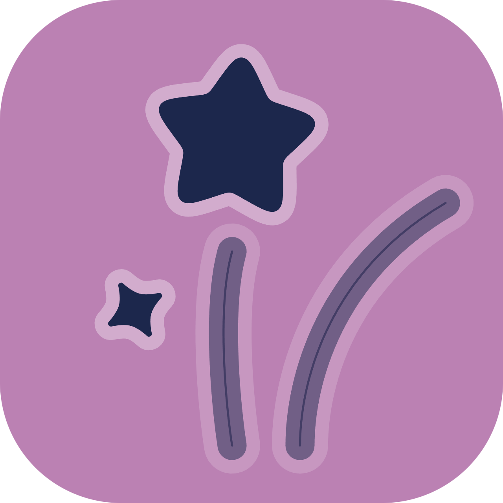
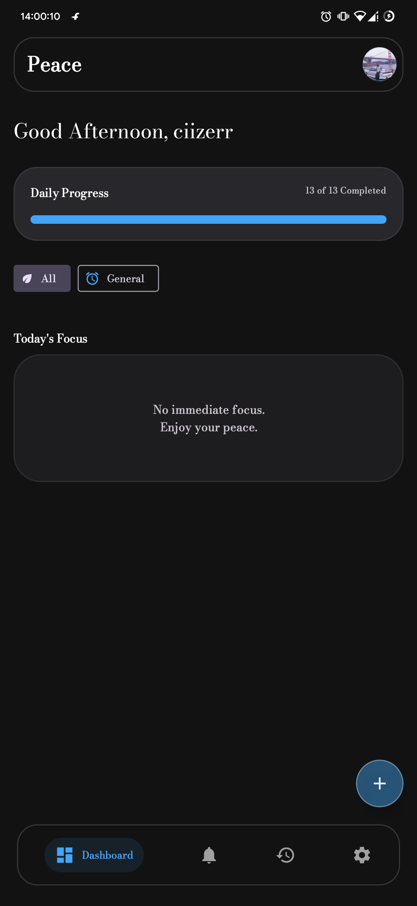
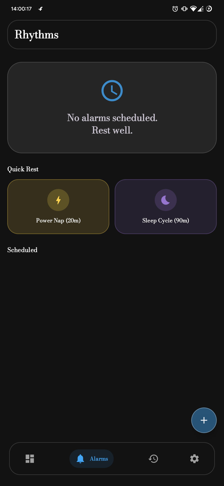
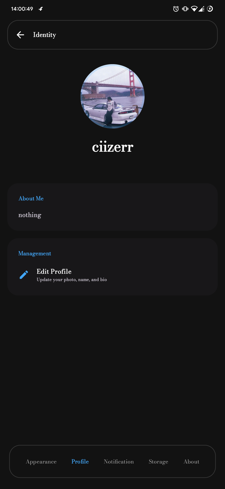
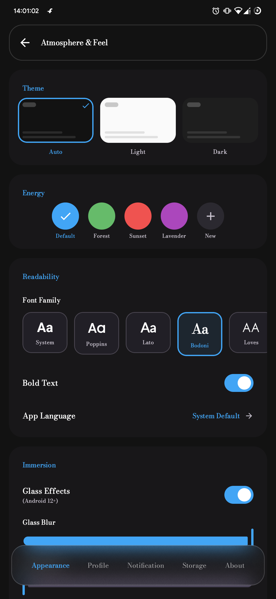

# Peace 🕊️
> *A Mindful, Glassmorphic Task Management & Alarm Application*

<div align="center">
  
  <br/>
  <br/>
  <p>
    Calm engagement, mindful reminders, and serene progress tracking built with Jetpack Compose and the Haze glassmorphism engine.
  </p>
  <br/>
  <a href="https://kotlinlang.org/"></a>
  <a href="https://developer.android.com/jetpack/compose"></a>
  <a href="https://github.com/chrisbanes/haze"></a>
</div>

---

## 📱 Screenshots

<div align="center">
  
  
  
  
</div>

## 📖 About the Project

Most reminder apps are stressful lists. **Peace** is designed around the philosophy of *"Calm Engagement."* By utilizing a state-of-the-art **Glassmorphism Design System**, Peace replaces sharp, demanding notifications with gentle, translucent UI elements. It encourages consistency through a minimalist aesthetic and prioritizes your mental well-being with mindful scheduling features.

## ✨ Key Features

- **🧊 Premium Glassmorphism UI**: A custom design system featuring beautiful frosted-glass effects, dynamic blurs, and translucent components that adapt to your background.
- **🕰️ Intelligent Rhythms**: Advanced scheduling with "Nag Mode" (to keep you on track) and "Strict/Flexible" logic to balance productivity with your natural pace.
- **🛡️ Data Sanctuary**: Robust local data protection with manual JSON export/import and **automated periodic backups** (Daily, Weekly, Monthly) to ensure your history is never lost.
- **🌙 Quiet Hours**: A dedicated peaceful mode that silences non-essential reminders and shifts the UI into a more serene state during your personal time.
- **📈 Activity & History tracking**: Browse your completed and abandoned tasks with high-detail logs to reflect on your daily progress.

## 🛠️ Tech Stack

- **🤖 Kotlin**: 100%
- **🎨 Jetpack Compose**: Material 3 Design
- **🌊 Haze Engine**: Advanced GPU-accelerated background blur for glassmorphism.
- **🏗️ WorkManager**: Reliable background scheduling for alarms and automated backups.
- **🏛️ Architecture**: MVVM with Clean Architecture principles.
- **🗄️ Local Data**: Room Database & DataStore Preferences.

## 🚀 Getting Started

### Prerequisites
- Android Studio (Ladybug/2025 version or newer)
- Android device or emulator running API 26 (Android 8.0) or higher.

### Setup Instructions

1.  **Clone the repository**:
    ```bash
    git clone https://github.com/ciizerr/Peace.git
    ```

2.  **Open in Android Studio**:
    Open the project folder in Android Studio and let Gradle sync.

3.  **Build and Run**:
    Run the app on your device or emulator. No external API keys are required for the core experience.

## 🤝 Contributing

We believe in calm collaboration. If you have ideas to make Peace even more serene, feel free to open an issue or submit a pull request.

## 🙏 Acknowledgments

- **[Haze](https://github.com/chrisbanes/haze)** by [Chris Banes](https://github.com/chrisbanes): The foundational engine for our glassmorphism effects.

## 📄 License

This project is licensed under the MIT License - see the [LICENSE](LICENSE) file for details.

---
<div align="center">
  <sub>Built with 💜 by <a href="https://github.com/ciizerr">ciizerr</a></sub>
</div>
